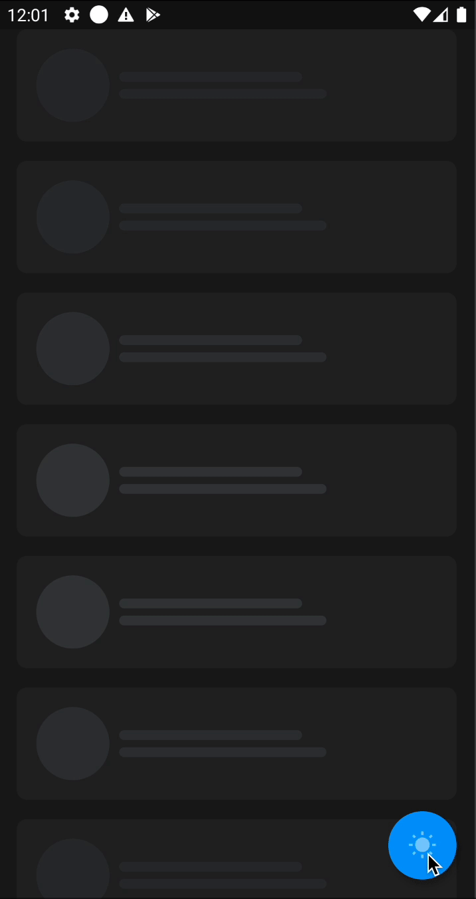

# FadeShimmer

[](https://pub.dev/packages/fade_shimmer)
[](https://opensource.org/licenses/MIT)

A customizable Flutter package that provides elegant shimmer loading effects with smooth fade transitions. Perfect for creating skeleton screens while your content is loading.

## Demo



## Features

- 🎨 Customizable colors and dimensions
- 🌓 Built-in light and dark themes
- ⏱️ Configurable animation duration
- 🌊 Support for staggered animations with delay parameter
- 🔄 Synchronized animations across multiple shimmer elements
- 🔘 Convenient factory for creating circular shimmer effects

## Installation

Add `fade_shimmer` to your `pubspec.yaml` file:

```yaml
dependencies:
  fade_shimmer: ^2.3.0
```

Run the following command to install:

```bash
flutter pub get
```

## Usage

### Import the package

```dart
import 'package:fade_shimmer/fade_shimmer.dart';
```

### Basic Usage

#### Create a rectangular shimmer

```dart
FadeShimmer(
  height: 8,
  width: 150,
  radius: 4,
  fadeTheme: FadeTheme.light,
)
```

#### Create a circular shimmer (for avatars/profile pictures)

```dart
FadeShimmer.round(
  size: 60,
  fadeTheme: isDarkMode ? FadeTheme.dark : FadeTheme.light,
)
```

#### Custom colors

```dart
FadeShimmer(
  height: 8,
  width: 150,
  radius: 4,
  highlightColor: Color(0xffF9F9FB),
  baseColor: Color(0xffE6E8EB),
)
```

### Advanced Usage

#### Staggered animation effect

Create a wave-like loading effect by adding delays to each shimmer element:

```dart
Column(
  children: [
    FadeShimmer(
      height: 8,
      width: 150,
      radius: 4,
      millisecondsDelay: 0,
      fadeTheme: FadeTheme.light,
    ),
    SizedBox(height: 8),
    FadeShimmer(
      height: 8,
      width: 170,
      radius: 4,
      millisecondsDelay: 300, // 300ms delay
      fadeTheme: FadeTheme.light,
    ),
    SizedBox(height: 8),
    FadeShimmer(
      height: 8,
      width: 120,
      radius: 4,
      millisecondsDelay: 600, // 600ms delay
      fadeTheme: FadeTheme.light,
    ),
  ],
)
```

#### Changing animation duration

You can change the global animation duration for all shimmer widgets:

```dart
// Change animation duration to 3 seconds (default is 1 second)
FadeShimmer.animationDurationInMillisecond = 3000;
```

**Note:** This change affects all FadeShimmer widgets in your application.

## Customization

### Available Properties

| Property | Type | Description |
|----------|------|-------------|
| `width` | `double` | Width of the shimmer container (required) |
| `height` | `double` | Height of the shimmer container (required) |
| `radius` | `double` | Border radius of the shimmer container (default: 0) |
| `fadeTheme` | `FadeTheme` | Predefined theme (light or dark) |
| `highlightColor` | `Color` | The brighter color that the shimmer transitions to |
| `baseColor` | `Color` | The darker color that the shimmer starts with |
| `millisecondsDelay` | `int` | Delay before the animation starts (default: 0) |

### Predefined Themes

- `FadeTheme.light` - Light gray colors suitable for light backgrounds
- `FadeTheme.dark` - Dark gray colors suitable for dark backgrounds

## Example Project

Check out the [example](https://github.com/quango2304/fade_shimmer/tree/master/example) directory for a complete sample application using FadeShimmer.

## Compatibility

- Supports Flutter 3.0 and above
- Null safety compatible
- Works on all platforms (Android, iOS, Web, Desktop)

## Contributing

Contributions are welcome! If you find a bug or want a feature, please open an issue on the [GitHub repository](https://github.com/quango2304/fade_shimmer).

## License

This project is licensed under the MIT License - see the [LICENSE](LICENSE) file for details.